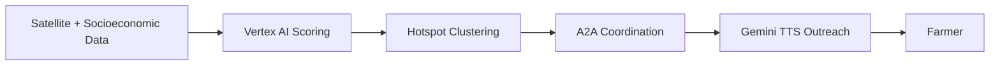

# BurnSignal

**A predictive agricultural burning agent that stops stubble fires before they're lit.**

BurnSignal models stubble-burning ignition probability at the farm-plot level using satellite crop residue indices and socioeconomic pressure signals, then autonomously dispatches pre-event outreach to at-risk farmers through local extension workers — before the burn decision is made, not after the smoke.

Built for the **BRICS Sustainability Challenge**.

---

## The Problem

Major BRICS cities and agricultural regions monitor air quality at a macro level but consistently miss hyper-local, cross-border pollution events — industrial emissions, large-scale agricultural burning, trans-boundary smog. Stubble burning in particular is currently detected only *after* ignition (via thermal satellite anomaly), when the health and climate damage is already done. Enforcement-based interventions have low compliance because they don't address the farmer's real constraint: burning is the fastest, cheapest way to clear a field before the next sowing deadline.

BurnSignal targets the decision window *before* that fire is lit.

---

## How It Works

1. **Predict** — Combines Landsat-8/Sentinel-2 NDVI differencing (post-harvest residue load per plot) with district-level MSP realization and subsidy-uptake rates (economic pressure signals) to score every plot's burn-likelihood over a rolling 72-hour window, via a Vertex AI AutoML model.
2. **Cluster** — Groups high-probability plots into geographic/temporal hotspots.
3. **Route** — An agent-to-agent (A2A) coordination layer maps each cluster to the nearest registered Krishi Vigyan Kendra (KVK) extension worker and an available stubble-management equipment slot.
4. **Reach out** — Gemini TTS generates a personalized, vernacular voice script offering the farmer that equipment booking, delivered by the extension worker before the burn decision is made.

---

## Documentation

| Doc | Covers |
|---|---|
| [`project_overview.md`](./project_overview.md) | Problem statement, goals, success metrics, scope, risks, milestones |
| [`architecture.md`](./architecture.md) | System design, data flow, ML architecture, non-functional requirements, deployment topology |
| [`implementation.md`](./implementation.md) | Module-by-module specs, data schemas, API contracts, deployment steps, testing strategy |

Start with `project_overview.md` for context, `architecture.md` for system design, and `implementation.md` when you're ready to build.

---

## Tech Stack

- **Data ingestion:** Google Earth Engine (Sentinel-2, Landsat-8)
- **Storage:** BigQuery, Cloud Storage
- **ML:** Vertex AI AutoML (regression)
- **Orchestration:** Gemini-CLI, A2A agent coordination
- **Outreach:** Gemini TTS (vernacular voice scripts)
- **Infra:** Cloud Run, Cloud Scheduler, Terraform

---

## Project Status

Hackathon MVP — see `project_overview.md` (Section 9, Milestones) for phase breakdown and `implementation.md` (Section 9, Open Decisions) for what still needs sign-off before each phase starts.

## Scope Note

BurnSignal is outreach-only by design. It never triggers penalty or enforcement action, and no alert is dispatched to a farmer without a valid, available equipment alternative attached to it.
