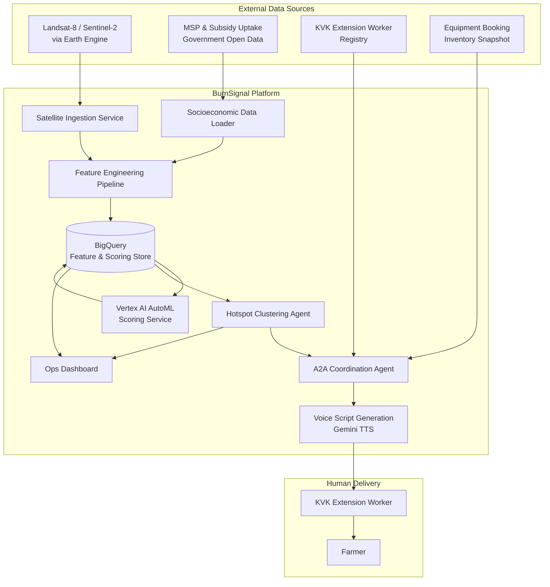
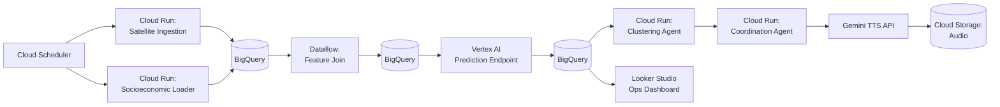

# BurnSignal — Architecture

**Document version:** 1.0
**Companion documents:** `project_overview.md` (why/what), `implementation.md` (how, module-by-module)

---

## 1. Architecture Principles

1. **Predict before ignition.** Every component in the critical path is sized against a 72-hour scoring-to-dispatch budget — see Section 9.3.
2. **Two independent signal families, fused late.** Biophysical signal (satellite) and socioeconomic signal (MSP/subsidy) are ingested, stored, and feature-engineered independently, and only joined at model-input time. This keeps each pipeline replaceable without touching the other (required for BRICS interoperability — a different country swaps its socioeconomic data source without touching the satellite pipeline).
3. **Agent orchestration is a thin coordination layer, not a monolith.** Gemini-CLI orchestrates discrete, independently deployable services via well-defined data contracts (Section 10), not in-process function calls.
4. **No alert without an action.** The system will not generate or dispatch an alert unless a valid, available intervention (equipment slot) can be attached to it (enforced at the Coordination Agent, Section 7).
5. **Batch-first, streaming-later.** MVP is a scheduled batch pipeline (Cloud Scheduler-triggered), not a streaming system. This matches the actual cadence of the underlying data (satellite revisit, not sub-second events) and avoids over-engineering.

---

## 2. System Context Diagram

---

## 3. Component Overview

| Component | Responsibility | Primary tech | Trigger |
|---|---|---|---|
| Satellite Ingestion Service | Pull Sentinel-2/Landsat-8 imagery via Earth Engine, compute NDVI differencing per plot | Python, Google Earth Engine API | Cloud Scheduler, every 24h |
| Socioeconomic Data Loader | Load/refresh MSP realization and subsidy-uptake data into BigQuery | Python, BigQuery client | Cloud Scheduler, weekly |
| Feature Engineering Pipeline | Join biophysical + socioeconomic signals into a single model-ready feature table | Dataflow (Apache Beam) or scheduled BigQuery SQL | On completion of both ingestion jobs |
| Burn-Likelihood Scoring Service | Score every plot's 72h burn-likelihood using the trained AutoML model | Vertex AI AutoML (regression), Vertex AI Prediction endpoint | On feature table update |
| Hotspot Clustering Agent | Group high-scoring plots into geographic/temporal clusters | Python, scikit-learn (DBSCAN) | On scoring completion |
| A2A Coordination Agent | Map clusters → KVK jurisdiction → worker; attach an available equipment slot; assemble daily call list | Python, Gemini-CLI orchestration | On clustering completion |
| Voice Script Generation & Dispatch | Generate personalized vernacular voice script per farmer; write dispatch record | Gemini TTS API | On call-list assembly |
| Ops Dashboard | Read-only view of scored plots, clusters, dispatch status | Looker Studio or lightweight web app reading BigQuery | On demand |

---

## 4. Data Flow (End-to-End Pipeline)

1. **T–24h:** Satellite Ingestion Service pulls latest available imagery tile for the pilot district; computes NDVI for current pass; differences against last known pre-harvest NDVI baseline per plot; writes `residue_index` rows to BigQuery.
2. **Weekly (independent cadence):** Socioeconomic Data Loader refreshes `msp_realization_rate` and `subsidy_uptake_rate` per district/block into BigQuery.
3. **On both sources current:** Feature Engineering Pipeline joins `residue_index` (plot-level, daily) with `msp_realization_rate`/`subsidy_uptake_rate` (block-level, weekly, broadcast down to plots in that block) into `plot_features` table.
4. **On `plot_features` update:** Scoring Service calls the Vertex AI Prediction endpoint for every active plot, writes `burn_likelihood_score` (0–1) and `scoring_window_end` (now + 72h) to `plot_scores`.
5. **On `plot_scores` update:** Clustering Agent selects plots above threshold (configurable, default 0.6), runs spatial DBSCAN (eps configurable in meters) with a temporal filter (scoring_window overlap), writes `hotspot_clusters`.
6. **On new/updated cluster:** Coordination Agent resolves each plot in the cluster to a KVK worker via `kvk_jurisdiction_map`, resolves nearest available slot in `equipment_inventory`, and writes one `dispatch_task` row per farmer with worker assignment and equipment reference. If no worker mapping exists, the task is escalated to `district_officer_queue` instead (fallback path, see `project_overview.md` Section 8 risk mitigation).
7. **On new `dispatch_task`:** Voice Script Generation calls Gemini TTS with a templated prompt (farmer name, plot ID, residue estimate, nearest equipment slot, worker callback number) in the configured vernacular language, writes the generated audio reference and script text to `dispatch_task.script_ref`, and marks the task `ready_for_delivery`.
8. **Delivery (MVP):** Worker receives their daily call list (task rows filtered to their `worker_id`) via the Ops Dashboard; MVP does not auto-place the call (see `project_overview.md` Section 6.2).

---

## 5. Data Architecture

### 5.1 BigQuery datasets

| Dataset | Purpose |
|---|---|
| `burnsignal_raw` | Landing zone for raw ingested data (satellite tile metadata, raw MSP/subsidy CSVs) |
| `burnsignal_features` | Cleaned, joined, model-ready feature tables |
| `burnsignal_scoring` | Model scores, clusters, dispatch tasks — operational state |
| `burnsignal_registry` | Reference/static data: plot boundaries, KVK jurisdiction map, equipment inventory |

Full table-level schema definitions are in `implementation.md`, Section 4.

### 5.2 Storage for unstructured assets

| Store | Contents |
|---|---|
| Cloud Storage bucket `burnsignal-imagery` | Raw/intermediate satellite imagery tiles (GeoTIFF) |
| Cloud Storage bucket `burnsignal-audio` | Generated TTS audio files, referenced by `dispatch_task.script_ref` |

---

## 6. ML Architecture

- **Model type:** Vertex AI AutoML Tables — regression, target `burned_within_72h` (0/1 in training data, treated as a continuous propensity target — see Note below).
- **Training data:** Historical plots labeled using VIIRS/MODIS active-fire detections as ground truth for actual burn events, joined back to that plot's `residue_index` and socioeconomic features at T–72h before the detected fire.
- **Features (v1):**
  - `residue_index` (float, NDVI differencing magnitude)
  - `residue_index_trend_7d` (float, rate of change)
  - `msp_realization_rate` (float, block-level)
  - `subsidy_uptake_rate` (float, block-level)
  - `days_since_harvest_estimate` (int)
  - `plot_area_hectares` (float)
  - `sowing_deadline_pressure_days` (int, days until next-crop sowing deadline — proxy for time pressure to clear the field)
- **Output:** `burn_likelihood_score` (float, 0–1), interpreted as a propensity score and thresholded for clustering (Section 4, step 5).
- **Retraining cadence:** Once per season (pre-harvest window), or when precision@top-decile on a rolling backtest drops below the 0.65 target defined in `project_overview.md` Section 5.
- **Note:** AutoML regression is used rather than classification because the 72h scoring window is continuous (a plot can be re-scored daily as it approaches ignition), and a continuous score is required as clustering agent input rather than a binary label.

---

## 7. Agent Orchestration (Gemini-CLI + A2A)

- **Gemini-CLI** is the top-level orchestrator: it runs the scheduled pipeline (steps 1–7 in Section 4) as a sequence of tool calls to each service, handling retries and passing structured JSON between steps.
- **A2A (agent-to-agent) coordination** refers specifically to the handoff between the Clustering Agent and the Coordination Agent: the Clustering Agent emits a cluster object; the Coordination Agent consumes it and independently resolves worker/equipment mapping. These are separate deployable agents communicating via the `hotspot_clusters` → `dispatch_task` BigQuery contract (not a direct RPC), so either can be redeployed or replaced independently — this is the seam where a second BRICS-nation implementation would swap in its own worker-registry/equipment-inventory logic without touching the scoring pipeline.

---

## 8. External Integrations

| Integration | Purpose | Notes |
|---|---|---|
| Google Earth Engine | Satellite imagery source (Sentinel-2, Landsat-8) | Requires a registered Earth Engine service account (Assumption A5, `project_overview.md`) |
| Government open data (MSP, subsidy uptake) | Socioeconomic feature source | Batch/CSV in MVP (Assumption A3) |
| KVK extension worker registry | Human delivery routing | Static registry in MVP; production would integrate with a live government HR/roster system |
| Equipment booking inventory | Intervention offer | Static snapshot in MVP (Section 6.2, `project_overview.md`) |
| Gemini TTS API | Vernacular voice script generation | Output is a script + audio reference, not a placed phone call |

---

## 9. Non-Functional Requirements

### 9.1 Scalability
Pilot district scope (Section 6.1, `project_overview.md`) is expected to be on the order of 10^4–10^5 plots. BigQuery and Vertex AI Prediction batch scoring comfortably handle this volume; no horizontal scaling design is required for MVP. Scaling to multi-district requires partitioning `plot_features`/`plot_scores` by district (already included as a column, see `implementation.md` Section 4) — no architectural change, just increased job parallelism.

### 9.2 Reliability & availability
Batch pipeline, not user-facing real-time service — availability target is "completes within its scheduled window," not "always up." Each pipeline step (Section 4) writes its output to BigQuery before signaling completion, so a failed downstream step can be retried against the last-good upstream output without re-running the whole pipeline.

### 9.3 Latency budget (72-hour window)
| Stage | Budget |
|---|---|
| Satellite ingestion → `residue_index` written | < 4 hours from imagery availability |
| Feature join | < 1 hour after both sources current |
| Scoring | < 30 minutes for full district |
| Clustering | < 15 minutes |
| Coordination + script generation | < 15 minutes |
| **Total, data-available to dispatch-ready** | **< 6 hours**, leaving ≥ 66 hours of the 72-hour window for actual human outreach and equipment booking |

### 9.4 Security & data privacy
- Farmer contact information (phone numbers, names) is PII and is stored only in `burnsignal_registry` with column-level access restricted to the Coordination Agent service account and the Ops Dashboard's authenticated worker view (a worker sees only their own assigned tasks).
- Generated audio files in `burnsignal-audio` are access-controlled per worker (signed URLs, short expiry) — not publicly readable.
- No farmer PII is included in any aggregate/anonymized output consumed by the district officer or State Pollution Control Board views (Section 4, `project_overview.md` stakeholder table) — those views read only `hotspot_clusters`, never `dispatch_task`.

### 9.5 Observability
Every pipeline stage writes a row to a `pipeline_run_log` table (run ID, stage, start/end timestamp, row counts in/out, status) so a failed or delayed run is diagnosable from BigQuery directly without log-diving.

---

## 10. Data Contracts (Interoperability Seam)

The following table/field contracts are the stable interface between pipeline stages, and are the artifacts a second BRICS-nation deployment would need to reproduce with its own upstream data sources:

- `plot_features` (Section 6, feature list) — biophysical + socioeconomic features joined to a plot ID and timestamp.
- `plot_scores` — plot ID, score, scoring window.
- `hotspot_clusters` — cluster ID, member plot IDs, centroid, window.
- `dispatch_task` — the single contract a country's own delivery mechanism (call center, SMS gateway, worker app) must consume: worker/queue assignment, farmer contact reference, script reference, equipment reference, status.

Full field-level schemas are defined in `implementation.md`, Section 4.

---

## 11. Failure Modes & Mitigations

| Failure | Detection | Mitigation |
|---|---|---|
| Earth Engine imagery unavailable for a pass (cloud cover) | `residue_index` row missing for expected plot/date in `pipeline_run_log` | Fall back to last available `residue_index` value, flag `stale_imagery = true` on the feature row so the model can down-weight it |
| Vertex AI Prediction endpoint quota/latency exceeded | `pipeline_run_log` stage timeout | Batch scoring in chunks (configurable batch size), retry with backoff |
| No KVK worker mapped to a cluster's plots | Coordination Agent lookup miss | Route to `district_officer_queue` fallback (Section 4, step 6) instead of dropping the alert |
| Equipment inventory has no available slot near a cluster | Coordination Agent lookup miss | Task is created with `equipment_ref = null` and flagged `escalation_required`; per Architecture Principle 4, this is *not* dispatched to the farmer until an equipment reference is attached, but the officer queue is notified so capacity can be added |

---

## 12. Deployment Topology (GCP)

Each Cloud Run service is stateless and independently deployable/redeployable, consistent with Architecture Principle 3.
